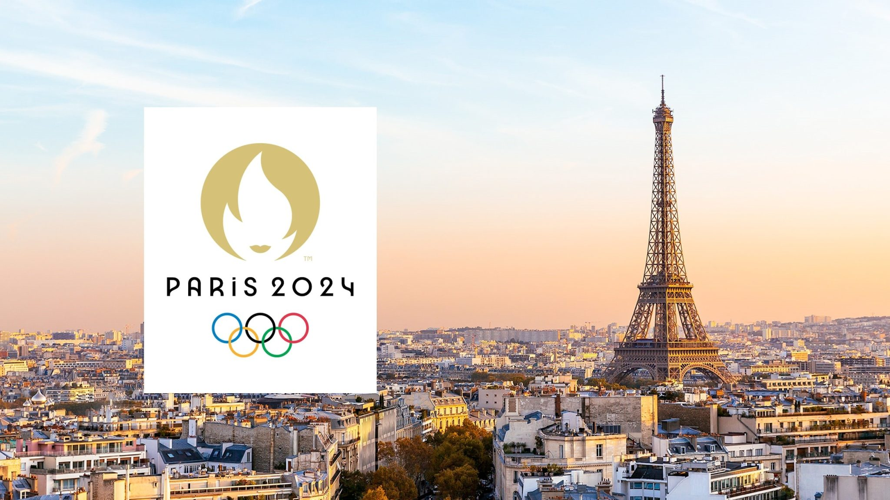
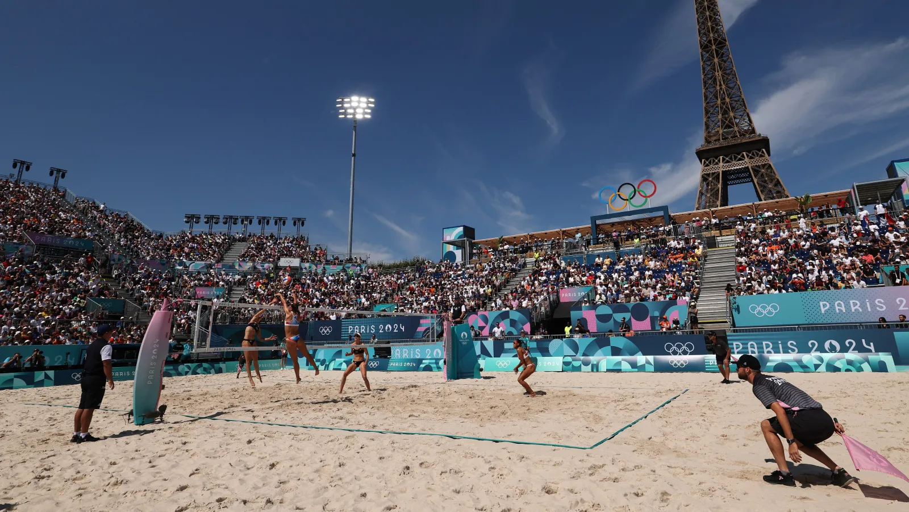
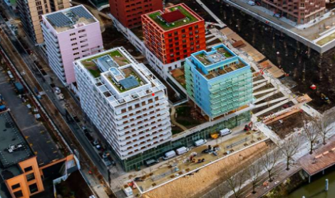
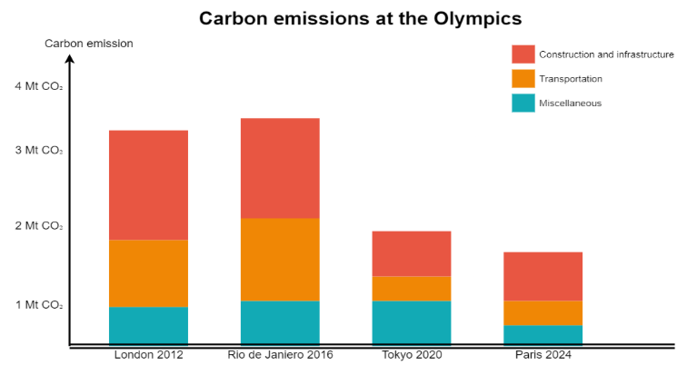

# How the Olympics 2024 in Paris became the most sustainable games in modern times

**Paris, France**. After 124 years, Paris hosted the Olympic Games again. At the 1900 games, female athletes were allowed to participate for the first time. This time Paris 2024 aimed to become the most sustainable Olympic Games in modern history.

## Venues

**95% of all venues** used at the Paris 2024 Olympic Games were either pre-existing or temporarily constructed. By utilizing existing materials and equipment at these venues, such as benches, high tables, and microwaves, the event achieved a 25% reduction of environmental impact.

## Construction

**100% of the buildings** below 28 meters in height used wood as a structural material, including beams, posts, and floors, with a total consumption of 16,000 m³ of wood. The concrete used was low-carbon concrete (150 kg CO₂/m³) and ultra-low-carbon concrete (100 kg CO₂/m³), compared to the traditional 250 kg CO₂/m³ concrete.

## Transportation

**Paris built 415 km of cycling lanes**, along with 20,000 temporary parking spaces to form a cycling network connecting all venues in Paris. State and local authorities funded the project. All venues were accessible by public transport, and a new app was developed to help visitors navigate transport routes to the game venues.

## Outcome

**The carbon footprint** of the games was:

1.59 MTCO₂E

**Promoting public transportation** during the game resulted in

87%

of the audience used public transport to the venues.

**The newly constructed bicycle lanes** were used by

5%

of the spectators.

The result was that the 2024 Summer Olympics had the lowest reported carbon footprint in modern Olympic history of the Summer Olympics.

