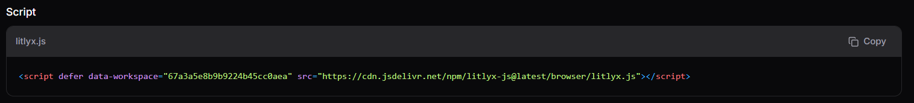
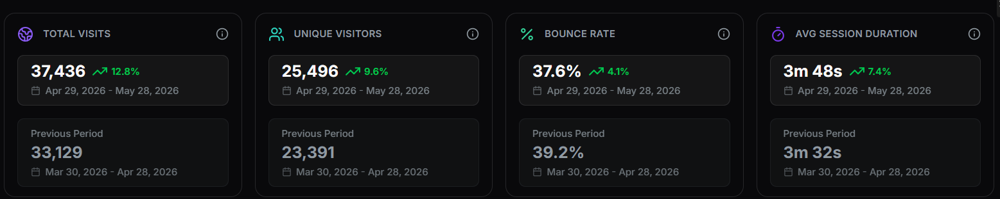
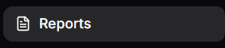
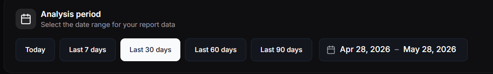
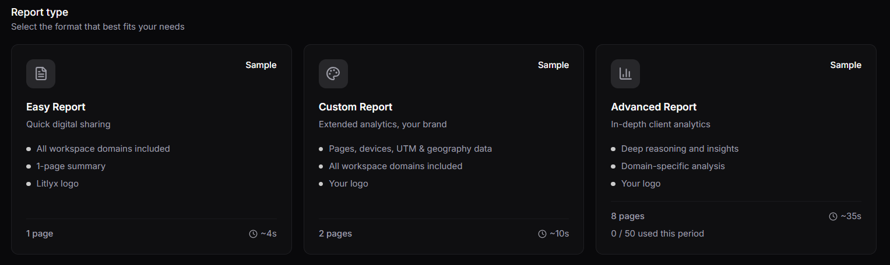
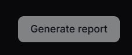

Litlyx is a traffic analytics platfform. The platform is 100% GDPR compliant and was founded in Italy, Europe.

Installing Litlyx on a documentation platform results in statistics and usage tracking of the documentation.

## Installing Litlyx

1. Go to the [Official Webpage](https://www.litlyx.com) and sign up for an account.

2. When logged in, click on *Create Workspace*.

3. In the menubar, click on *Web*.

4. Copy the script tag that is being displayed.

5. Paste the script tag in your repository in `index.html`inside the `<header>`.

6. Publish your documentation platform and click anywhere on the page to trigger an action.

7. Open Litlyx and verify the installation.

## Dashboard

The dashboard inside your workspace in Litlyx displays the following:

* Total visits.
    * How many times have your webpage being visited the previous month.
* Unique visitors.
    * How many unique visitors did your webpage have previous month.
* Bounce rate.
    * How many of your visitors did any interaction. For example, clicked a button or downloaded a file.
* Average session duration.
    * How long time did your users on average spend on your webpage during a session.

## Generate a Report

Litlyx can generate a report of the traffic to your webpage in a PDF-format. For best result, wait a month before to get full data for the report. Follow this step list to generate a report.

1. Open your workspace in Litlyx.

2. In the menubar, click *Report*.

3. Select a timeframe for the report by selecting *Start Period of the Report* and *End Period of the Report* in the dropdown menus.

4. Select a report type.

5. Click on the button *Generate Report*.

Litlyx has now generated a report in a PDF-format.