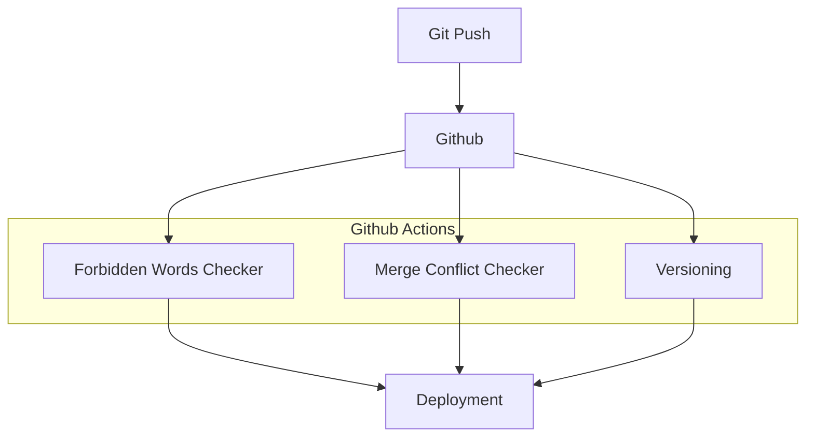

Pipelines are being triggered during 'git push' or deployment. These are being constructed to prevent issues to occur and to catch common mistakes.

## Further reading

- Read [about reference](https://diataxis.fr/reference/) in the Diátaxis framework
